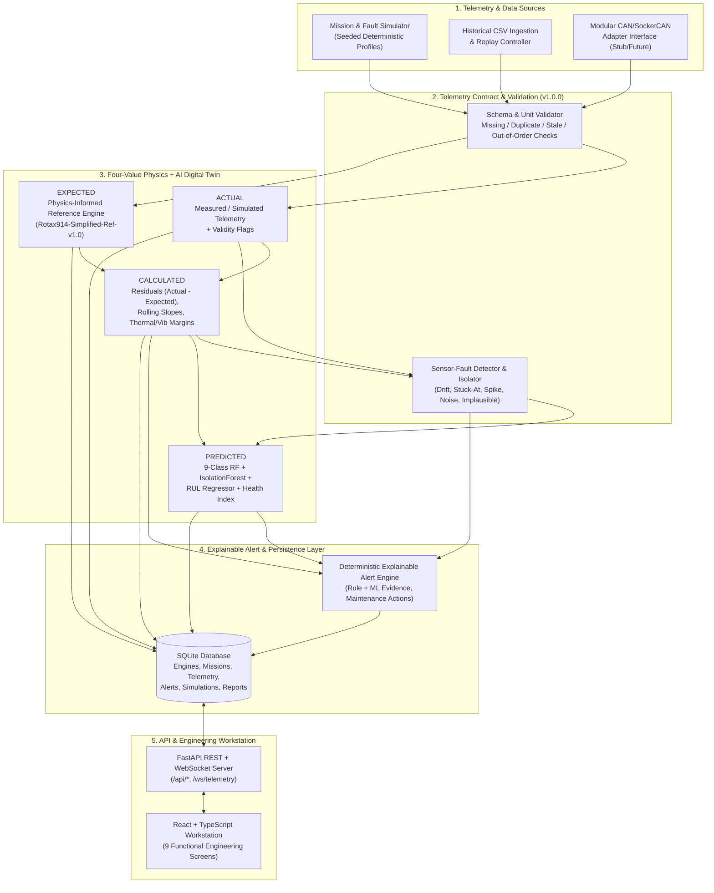

# DRISHTI Digital Twin — System Architecture & Data Flow (SIH26054)

## 1. Architectural Overview

**DRISHTI** (*AI-Enabled Real-Time Digital Twin for Aero Piston Engine Health Monitoring, Fault Prediction and Mission Reliability*) is designed as a modular, deterministic, physics-informed digital-twin engineering platform for 4-cylinder turbocharged horizontally-opposed aero piston engines used in Medium-Altitude Long-Endurance (MALE) UAVs.

---

## 2. Subsystem Decomposition

### 2.1 Telemetry Contract & Ingestion (`backend/app/telemetry/`)
- **`schema.py`**: Defines versioned (`TELEMETRY_SCHEMA_VERSION = "1.0.0"`) Pydantic models for `TelemetryFrame`, `UnitMetadata`, `DataQualityMetadata`, `FourValueDigitalTwinState`, and `CANFrameAdapter`.
- **`validator.py`**: Stateful per-engine stream validator that detects:
  - Missing fields and `NaN`/`Inf` values
  - Duplicate sequence numbers or timestamps
  - Out-of-order timestamps (`timestamp <= last_timestamp`)
  - Stale data (`delta_t > max_stale_seconds`)
  - Physical implausibility (sensor range bounds vs. operating envelope bounds)
- **`can_adapter.py`**: Documented modular interface (`AbstractCANAdapter`, `SimulatedSocketCANAdapter`) mapping UAV engine FADEC/EMS CAN bus frames (`0x101` Engine Speed/Load, `0x102` Thermal CHT/EGT, `0x103` Oil/Fuel, `0x104` Air Data/Electrical) into `TelemetryFrame` objects without fabricating live hardware connectivity.

### 2.2 Physics-Informed Reference Model (`backend/app/physics/`)
- **`engine_model.py`**: Standalone, stateless and stateful reference estimator (`AeroPistonReferenceModel`, version `Rotax914-Simplified-Ref-v1.0`) representing a 4-cylinder 1.2L turbocharged aero piston UAV engine (~115 HP rated at 5800 RPM, continuous cruise 4800–5200 RPM, service ceiling 7,000 m).
- Computes conditional **EXPECTED** values from operating inputs (`rpm`, `throttle_pct`, `engine_load_pct`, `altitude_m`, `ambient_temp_c`, `air_density_ratio`):
  - Expected CHT (°C)
  - Expected EGT (°C)
  - Expected Oil Pressure (bar) coupled with RPM and Oil Temperature viscosity effects
  - Expected Oil Temperature (°C)
  - Expected Fuel Flow (L/h) compensated for brake power demand and altitude turbocharger map
  - Expected Broadband Vibration RMS (mm/s) from 1st/2nd order reciprocating inertial excitation
  - Expected Manifold/Boost & Alternator Voltage (V)
  - Reference Injection Pulse Width (ms) & Ignition Advance (°BTDC)
- Evaluates **extrapolation flags** if inputs fall outside the supported operating envelope (`rpm` $\in [1400, 6000]$, `altitude_m` $\in [0, 7000]$, `ambient_temp_c` $\in [-35, +50]$, `throttle_pct` $\in [0, 100]$).

### 2.3 Deterministic 9-Class Fault & Mission Simulator (`backend/app/simulation/`)
- **`fault_simulator.py`**: Reproducible, seed-controlled generator supporting all 9 required diagnostic classes:
  1. `Normal`
  2. `Cylinder Overheating`
  3. `Oil Pressure Drop`
  4. `Crankshaft Bearing Wear`
  5. `Cylinder Misfire`
  6. `Sensor Fault` (sub-modes: drift, stuck-at, high-frequency noise, spike, missing samples, implausible out-of-range)
  7. `Piston Ring Wear`
  8. `Valve Clearance Issue`
  9. `Fuel Injector Clogging`
- **`mission_profiles.py`**: Generates 7 mission profiles (`normal_mission`, `high_altitude`, `hot_weather`, `long_endurance`, `rapid_throttle`, `controlled_fault_injection`, `historical_replay`) plus multi-cycle degradation trajectories for RUL training and evaluation.

### 2.4 Leak-Free Machine Learning Pipeline (`backend/app/ml/`)
- **`features.py`**: Causal time-series feature extractor computing instantaneous residuals (`actual - expected`), causal rolling means/standard deviations/slopes over a configurable window, thermal ratios (`CHT/EGT`), oil pressure-to-RPM ratios, specific fuel ratio, and sensor quality indicators.
- **`sensor_fault_isolator.py`**: Dedicated rule + residual consistency isolator that separates single-channel sensor anomalies (stuck-at zero derivative, unphysical single-channel spike, flatline noise loss, range violation without cross-channel thermodynamic corroboration) from true mechanical/thermal engine faults, returning `AMBIGUOUS` / `INSUFFICIENT_EVIDENCE` when cross-channel evidence conflicts.
- **`pipeline.py`**:
  - **Engine-Level & Trajectory-Level Separation**: Training and test splits are strictly partitioned by `engine_id` and `trajectory_id` (`GroupShuffleSplit`), guaranteeing zero leakage across rolling windows or shared trajectories.
  - **9-Class Fault Classifier**: `RandomForestClassifier` with `StandardScaler` fit strictly on training trajectories. Outputs calibrated class probabilities, confusion matrix, per-class precision/recall/F1, and macro-F1.
  - **Independent Anomaly Detector**: `IsolationForest` trained strictly on `Normal` training trajectories across diverse mission envelopes. Outputs raw anomaly score, calibrated threshold, recall, false alarm rate (FAR), and precision-recall curve points.
  - **RUL Estimator**: Trained on explicit multi-mission synthetic degradation trajectories (`target = remaining_mission_hours` until critical failure threshold). Uses `RandomForestRegressor` (with ensemble tree variance for 10th–90th percentile uncertainty bounds). Returns `NOT_ESTIMABLE` when telemetry is invalid, insufficient history exists, or engine shows no degradation trajectory.
  - **Transparent Health Index (HI)**: Documented weighted composite of thermal margin, oil system integrity, mechanical vibration margin, and anomaly score.

### 2.5 Explainable Alert Engine & Persistence (`backend/app/alerts/` & `backend/app/db/`)
- **`alert_engine.py`**: Synthesizes rule-based and ML predictions into structured, auditable alerts containing `alert_id`, `engine_id`, `mission_id`, `timestamp`, `fault_class`, `severity` (`ADVISORY`, `CAUTION`, `WARNING`, `CRITICAL`), supporting residual evidence, model confidence, data quality flags, and deterministic maintenance action recommendations.
- **`database.py`**: SQLite persistence managing `engines`, `missions`, `telemetry_records`, `alerts`, `simulations`, and `reports`, with deterministic fleet seeding.
